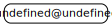
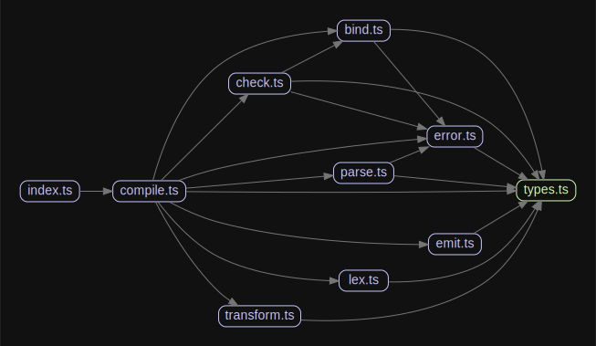

# 源码分析

## 文件结构

``` bash
/Users/liufang/openSource/FunnyLiu/mini-typescript
├── LICENSE
├── README.md
├── baselines
|  └── reference
|     ├── basicLex.lex.baseline
|     ├── firstLex.lex.baseline
|     ├── newlineLex.lex.baseline
|     ├── redeclare.errors.baseline
|     ├── redeclare.js.baseline
|     ├── redeclare.tree.baseline
|     ├── semicolonLex.lex.baseline
|     ├── singleIdentifier.errors.baseline
|     ├── singleIdentifier.js.baseline
|     ├── singleIdentifier.tree.baseline
|     ├── singleTypedVar.errors.baseline
|     ├── singleTypedVar.js.baseline
|     ├── singleTypedVar.tree.baseline
|     ├── singleVar.errors.baseline
|     ├── singleVar.js.baseline
|     ├── singleVar.tree.baseline
|     ├── twoStatements.errors.baseline
|     ├── twoStatements.js.baseline
|     ├── twoStatements.tree.baseline
|     ├── twoTypedStatements.errors.baseline
|     ├── twoTypedStatements.js.baseline
|     ├── twoTypedStatements.tree.baseline
|     ├── underscoreLex.lex.baseline
|     └── varLex.lex.baseline
├── package-lock.json
├── package.json
├── src
|  ├── bind.ts
|  ├── check.ts
|  ├── compile.ts
|  ├── emit.ts
|  ├── error.ts
|  ├── index.ts
|  ├── lex.ts
|  ├── parse.ts
|  ├── test.ts
|  ├── transform.ts
|  └── types.ts
├── tests
|  ├── redeclare.ts
|  ├── singleIdentifier.ts
|  ├── singleTypedVar.ts
|  ├── singleVar.ts
|  ├── twoStatements.ts
|  └── twoTypedStatements.ts
└── tsconfig.json

directory: 4 file: 46

ignored

```

## 外部模块依赖



## 内部模块依赖


  

# mini-typescript
A miniature model of the Typescript compiler, intended to teach the structure of the real Typescript compiler

I started this project as part of reading [Modern Compiler Implementation in ML](https://www.cs.princeton.edu/~appel/modern/ml/) because I wanted to learn more about compiler backends. When I started building the example compiler I found I disagreed with the implementation of nearly everything in the *frontend*. So I wrote my own, and found that I had just written [a small Typescript](https://github.com/sandersn/minits).

I realised a small Typescript would be useful to others who want to learn how the Typescript compiler works. So I rewrote it in Typescript and added some exercises to let you practise with it. The resulting compiler covers a tiny slice of Typescript: just `var` declarations, assignments and numeric literals. The only two types are `string` and `number`.

### To get set up

```sh
git clone https://github.com/sandersn/mini-typescript
cd mini-typescript
code .

# Get set up
npm i
npm run build

# Or have your changes instantly happen
npm run build --watch

# Run the compiler:
npm run mtsc ./tests/singleVar.ts
```

## Limitations

1. This is an example of the way that Typescript's compiler does things. A compiler textbook will help you learn *compilers*. This project will help you learn *Typescript's code*.
2. This is only a tiny slice of the language, also unlike a textbook. Often I only put it one instance of a thing, like nodes that introduce a scope, to keep the code size small.
3. There is no laziness, caching or node reuse, so the checker and transformer code do not teach you those aspects of the design.
4. There's no surrounding infrastructure, like a language service or a program builder. This is just a model of tsc.

## Exercises

- Add EmptyStatement.
- Make semicolon a statement ender, not statement separator.
  - Hint: You'll need a predicate to peek at the next token and decide if it's the start of an element.
  - Bonus: Switch from semicolon to newline as statement ender.
- Add string literals.
- Add let.
  - Then add use-before-declaration errors in the checker.
  - Finally, add an ES2015 -> ES5 transform that transforms `let` to `var`.
- Allow var to have multiple declarations.
  - You'll need to convert a Symbol's declaration into a list.
  - Check that all declarations have the same type.
- Add type aliases.
  - You'll need to convert a Symbol's declaration into a list.
  - Name resolution will need to search a symbol's declarations to see whether it has a type declaration.
- Add an ES5 transformer that converts let -> var.
- Add function declarations and function calls.
- Add arrow functions with an appropriate transform in ES5.
